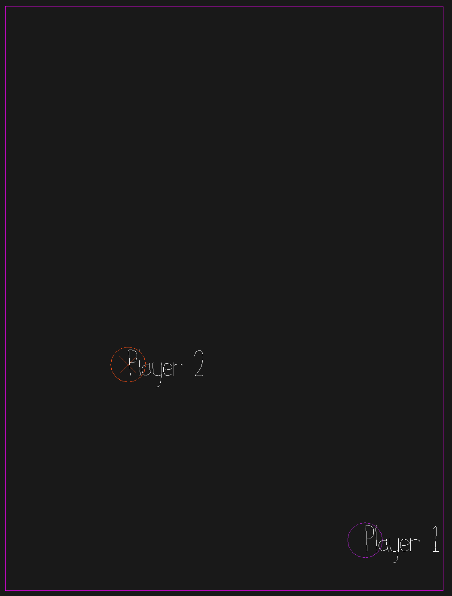

# I Was Tired

Author: Dakota Hernandez (dshernan)

Design: I had a really rough week last week working on the 15-440 programming. This week, I have a 15-440 midterm on Thursday so I made the decision to skip this game last Saturday. This is the starter code.

I considered making slight modifications to make a basic air hockey game like from Wii Play, but I instead decided to take a lighter work week.

Networking: The default networking code is used. I will examine it more over Fall break.

Screen Shot:

How To Play:

Use WASD to move around! It's like bumper cars!

Sources: 15-466 Starter Code

This game was built with [NEST](NEST.md).

